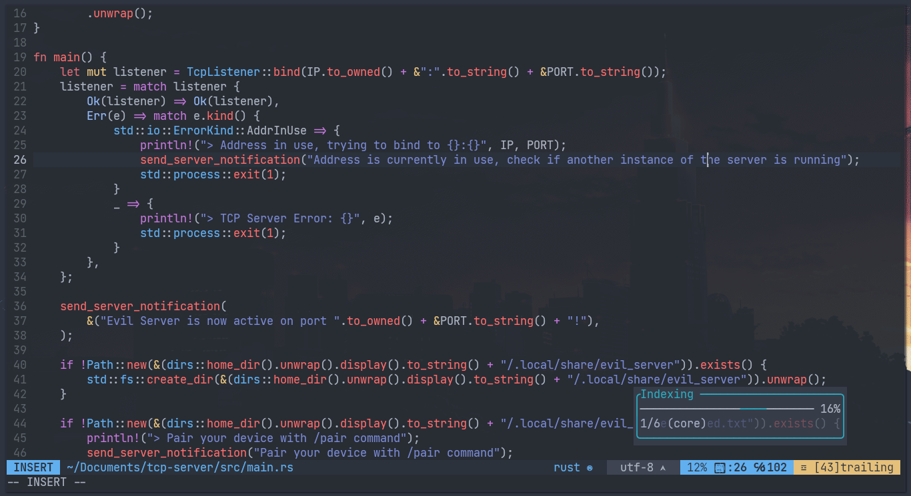
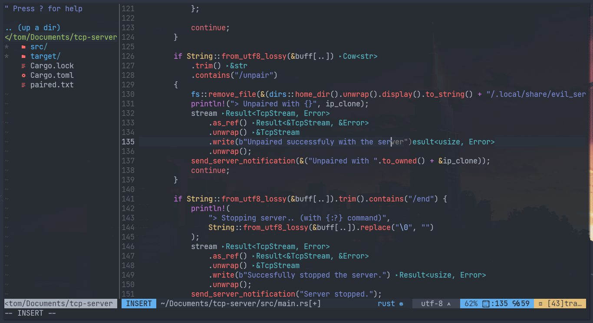

# My dotfiles for NeoVim

## About
This config uses [Lazy.nvim](https://github.com/folke/lazy.nvim) as a plugin manager.

## Setup
First, you have to clone this repo with [git](https://github.com/git/git).
If you already have your config in **~/.config/nvim**, make a backup of it first and then delete it.
```
$ git clone https://codeberg.org/tomkoid/neovim-dotfiles.git ~/.config/nvim
```
Now, to run the **install script**, you have to CD into **~/.config/nvim** directory.
```
$ cd ~/.config/nvim
```

If you have trouble with fonts, try to install these: `Noto Fonts, Noto Fonts Emoji, JetBrains Mono Nerd`.
In [Arch Linux](https://archlinux.org) you can install it with [pacman](https://wiki.archlinux.org/title/pacman) and [paru](https://github.com/Morganamilo/paru) (or with any other [AUR helper](https://wiki.archlinux.org/title/AUR_helpers))

Pacman:
```
$ pacman -S noto-fonts-emoji noto-fonts ttf-jetbrains-mono-nerd ttf-nerd-fonts-symbols ttf-nerd-fonts-symbols-mono
```
And with AUR helper:
```
$ paru nerd-fonts-meta
```

This package can be large, so this may take a while to install.
After the installation is complete, you're done!

### Screenshots:




