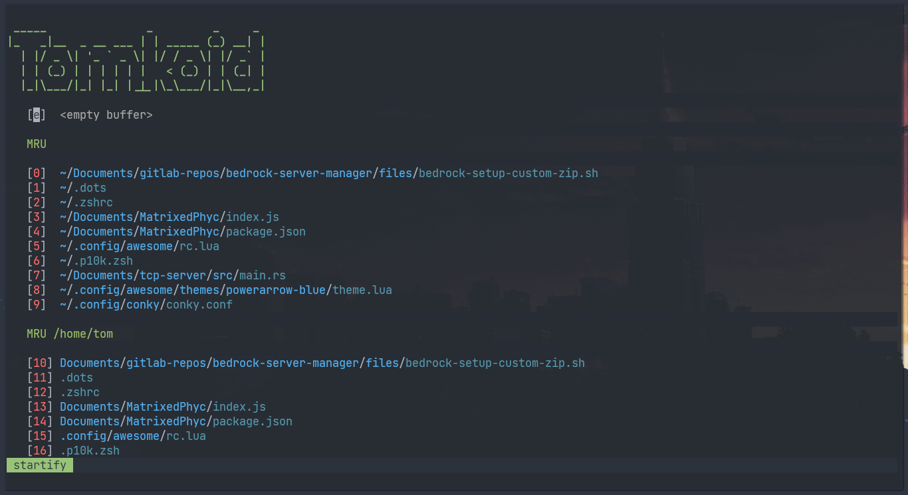

# My dotfiles for NeoVim

## About
This config uses [Packer](https://github.com/hashicorp/packer) as a plugin manager.

| Keybinding            | Description                                 |
|-----------------------|---------------------------------------------|
| Ctrl + t              | Opens up NerdTree                           |
| Ctrl + a              | Go to the beginning of the line	      |
| Ctrl + e              | Go to the end of the line	       	      |
| Ctrl + s              | Switches between windows                    |
| Ctrl + Left Arrow     | Switches to next tab                        |
| Ctrl + Right Arrow    | Switches to previous tab                    |
| Ctrl + h              | Resize window (-5)                          |
| Ctrl + l              | Resize window (+5)                          |
| F3                    | Clears search highlightning                 |
| F4                    | Wraps the text                              | 
| Ctrl + b              | Opens up new terminal with zsh shell        |

## Setup
First, you have to clone this repo to your machine with [git](https://github.com/git/git).
If you already have your configs in **~/.config/nvim**, backup them and delete them first.
```
$ git clone https://gitlab.com/Tomkoid/neovim-dotfiles.git ~/.config/nvim
```
Now, to run the **install script**, you have to CD into **~/.config/nvim** directory.
```
$ cd ~/.config/nvim
```
After that you can install [packer plugin manager](https://github.com/hashicorp/packer) and plugins with the following command.

**WARNING FOR DEBIAN USERS**: If you are using Debian, make sure you have installed yarn and node from [npm](https://www.npmjs.com).
If you don't have it already installed with [npm](https://www.npmjs.com), you can install it with: `$ sudo npm install -g yarn node`. 
```
$ ./install.sh
```
This will launch the **install script**.

After the plugins are downloaded and installed, quit Packer with `q` and quit [NeoVim](https://github.com/neovim/neovim) with `:qa` and the installation process will continue.
When the installation is done, you should have done.

If you have trouble with fonts, try to install these: `Ubuntu Font Family, JetBrains Mono, Nerd Fonts`.
In [Arch Linux](https://archlinux.org) you can install it with [pacman](https://wiki.archlinux.org/title/pacman) and [paru](https://github.com/Morganamilo/paru) (or with any other [AUR helper](https://wiki.archlinux.org/title/AUR_helpers))

Pacman:
```
$ pacman -S ttf-ubuntu-font-family ttf-jetbrains-mono ttf-nerd-fonts-symbols ttf-nerd-fonts-symbols-mono
```
And with AUR helper:
```
$ paru nerd-fonts-complete
```

This package can be large, so this may take a while to install.
After the installation of fonts is complete, you're done!

### Screenshots:



